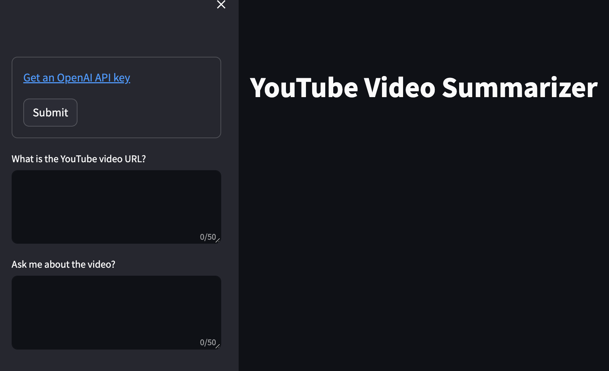

# YouTube Video Summarizer 📹



This repo provides video summaries based on youtube video links.

This project needs OpenAI APIs, so please creat secret key by using your OpenAI account and export to your environment variables but note that [OpenAI APIs](https://openai.com/api/pricing) is not free but it is not expensive for trial either.

Please, follow the steps bellow for an easy demo.


## Getting started
Install python dependencies;

```bash
pip install -r requirements.txt
```

Set up your OpenAI key;

```bash
export OPENAI_API_KEY='your-api-key-here'
```

Run the streamlit app;

```bash
streamlit run main.py
```


## Resources
[1] https://towardsdatascience.com/getting-started-with-langchain-a-beginners-guide-to-building-llm-powered-applications-95fc8898732c

[2] https://towardsdatascience.com/explaining-vector-databases-in-3-levels-of-difficulty-fc392e48ab78

[3] https://towardsdatascience.com/retrieval-augmented-generation-rag-from-theory-to-langchain-implementation-4e9bd5f6a4f2

[4] https://python.langchain.com/docs/use_cases/summarization/#option-1.-stuff

[5] https://platform.openai.com/docs/api-reference/authentication

[6] https://python.langchain.com/docs/get_started/introduction


## Authors
Kubilay Tuna


## License
GNU General Public License v3.0