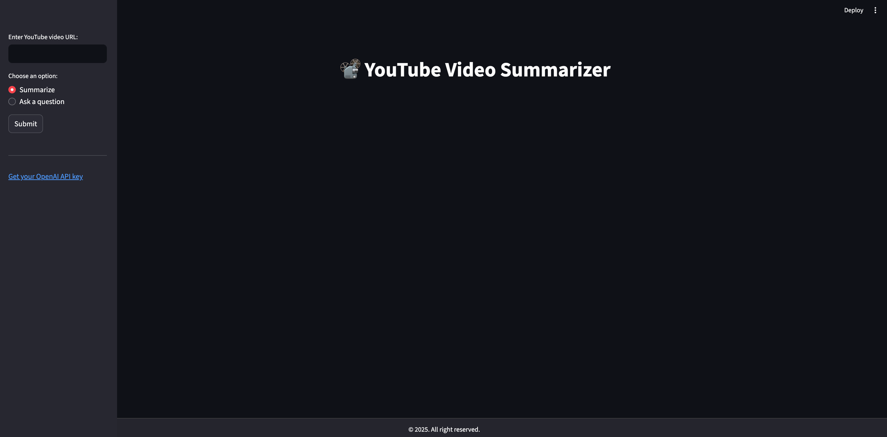

# 📹 YouTube Video Summarizer


An interactive Streamlit app that lets you **summarize YouTube videos** and **ask questions** about their content using **LangChain**, **OpenAI**, and **FAISS**. It automatically extracts transcripts and processes them with large language models (LLMs) for rich insights.

> ⚠️ **Note:** This app requires an [OpenAI API key](https://platform.openai.com/account/api-keys). OpenAI’s API is paid, but affordable for experimentation. No key = no magic. ✨

---

## 🚀 Getting Started

### 1. Clone the repository
```bash
git clone https://github.com/your-username/youtube-video-summarizer.git
cd youtube-video-summarizer
```

### 2. Install dependencies
```bash
pip install -r requirements.txt
```

### 3. Set up your OpenAI API key
You can either export it in your shell:

```bash
export OPENAI_API_KEY="your-api-key-here"
```

Or create a `.env` file based on the `.env.example` template:

```env
OPENAI_API_KEY=your-api-key-here
```

### 4. Run the Streamlit app
```bash
streamlit run main.py
```

## ✨ Features
| Feature               | Description                                                             |
| --------------------- | ----------------------------------------------------------------------- |
| ✅ Video Summarization | Converts transcripts into clear, structured summaries                   |
| 🧠 Chapter Extraction | Breaks down videos into chapters with titles and short descriptions     |
| ❓ Ask Questions       | Ask anything about the video using Retrieval-Augmented Generation (RAG) |
| 🔍 Evidence Display   | Shows transcript chunks retrieved for question answering                |
| 🎨 Auto Theme Support | Follows your system’s light/dark preference automatically               |

## 📚 Resources
* [LangChain Summarization Docs](https://python.langchain.com/docs/use_cases/summarization/)
* [RAG: Retrieval-Augmented Generation](https://towardsdatascience.com/retrieval-augmented-generation-rag-from-theory-to-langchain-implementation-4e9bd5f6a4f2)
* [Understanding Vector Databases](https://towardsdatascience.com/explaining-vector-databases-in-3-levels-of-difficulty-fc392e48ab78)
* [LangChain Introduction](https://python.langchain.com/docs/get_started/introduction)
* [OpenAI API Authentication](https://platform.openai.com/docs/api-reference/authentication)

---

## 👨‍💻 Author
**Kubilay Tuna**

🔗 [github.com/ktuna26](https://github.com/ktuna26)

## 📄 License
This project is licensed under the **GNU General Public License v3.0**.

## 💡 Tip
If you're running into issues with transcript languages, make sure the video supports English (`en`) or Turkish (`tr`) transcripts.
